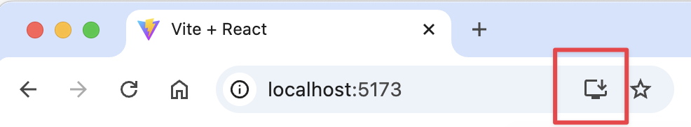
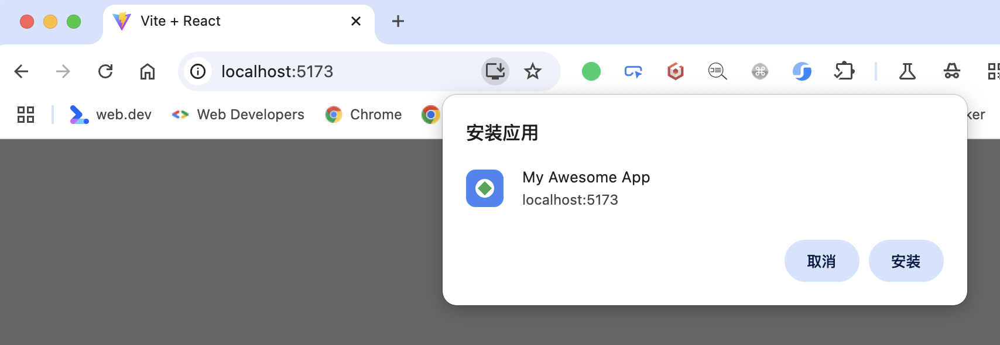
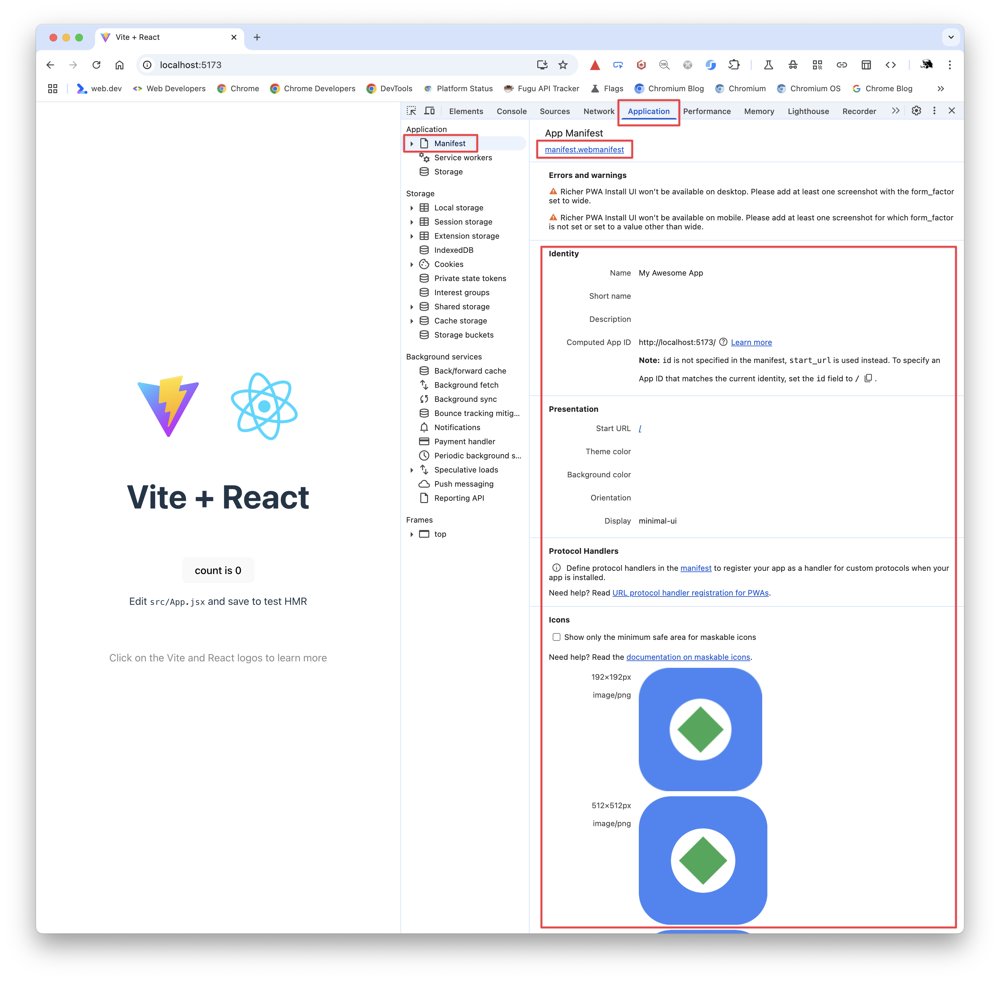

# Test PWA Installability

You can now launch the React site locally using your project's existing workflow.

Run the DevServer:

```bash npm2yarn
npm run dev
```

Or run a static web server:

<Tabs>
<TabItem value="vite" label="Vite">
```bash npm2yarn
npm run build
npm run preview
```
</TabItem>
<TabItem value="next" label="Next.js">
```bash npm2yarn
npm run build
npm run start
```
</TabItem>
</Tabs>

Then open the site's local URL in Chrome or Edge. You should see the PWA install button in the address bar of your browser:




Open your browser's DevTools, you should see how the browser has parsed the Web App Manifest for this page.

[](../../../assets/guide/pwa-3.png)

At this point, the site qualifies as a minimal PWA.

:::tip
After deploying to production, the site must be served over HTTPS. Otherwise, the browser will not recognize it as a PWA.
:::
